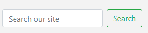

#  ***Paradise Pending...*** :sunny: **Porfolio Project 5 @ Code Institute**

- <mark>Paradise Pending</mark> is an online e-commerce clothing store. My thought proccess behind Paradise Pending was to code a bright, happy clothing store with a hint of deep refelction and hope for that feeling of Paradise. I wanted the users to feel as if Paradise was just on the horizon and that no matter how down you may feel right now, paradise is always just around the corner.
I wanted the clothes to have a summer vibe to it as Summer seems to be the time of the year when most are happy. Summer brings the feelings of Paradise and happiness to most people With the bright sun and the blue skies. I wanted the clothes to reflect this and bring a summer feel, along with the idea and reminder to everyone that things can always get better and that feeling of Paradise is always close by. My idea is to have different clothing drops for differnt seasons of the year. Paradise can come in all of the four seasons but for now I decided to focus on the summer vibes.

- <mark>Paradise Pending</mark> has been developed for my Portfolio Project 5 for Code Institue Full Stack Software Deveoper Course using Django, HTML, CSS, JS & Python. As of now this is a fictional Clothing Store for educational Purposes. Any payments made using a valid debit/credit card will not be processed and the card will not be charged. No orders made will be fulfilled.

[Paradise Pending live link](https://.herokuapp.com/)

---


---

# **1. Table of content :mortar_board:**


# **2. User Experience (UX) :art:**

## **2.1. The Strategy Plane**
The idea for Paradise Pending was to code a fully functional e-commerce store, where users can buy clothes. As stated above I wanted the Store to feel fun, happy and give summer vibes. I wanted the user to feel as if Paradise is pending and it is just around the corner no matter how they may feel at any given moment. For now I wanted the summer feel as most people related Paradise to Summer - Enjoying fruity drinks on the beach and chilling in the sun. Going foward I would like to have a different vibe and feel to the site for different seasons.

### **2.1.2. The Ideal User**
My target audience is everyone. No matter what age or gender you are Paradise Pending is for everyone.

- Ideal user likes the idea of Paradise 
- Ideal user like graphic tees and comfy joggers
- Ideal user likes the idea that Paradise is always just around the corner

### **2.1.3 Site Goals**
- To provide quality clothes for users (This is a fictional educational only website clothes are not for sale)
- To provide a quick, clear, and effiecent way to purchase clothes
- To be able to navigate the site with ease
- To be able to contact us if the user has any queries
- To be able to write reviews 
- To provide the users with our message that Paradise is Pending


### **2.1.4 Epics**
After thinking about my project, 9 Epics were created for this project. These Epics were the main sections of the TParadise Pending project. You can view the Epics via the KanBan board for this project. The Epics consisted of :

- EPIC 1 : Inital Setup + Settings
- EPIC 2 : Apps
- EPIC 3 : Templates
- EPIC 4 : Viewing & Navigation
- EPIC 5 : Sorting and Searching 
- EPIC 6 : Purchasing and Checkout
- EPIC 7 : User Accounts, Autehntication, Authorization & Registration
- EPIC 8: SEO & Web Marketing

  

 ### **2.1.5 User stories**

 I had a total of 30 User Stoires for this project. I categorized them via Must-Have -- Should-have -- Could have -- & Wont have.
Must haves were Crucial for this project. Should-haves were I should have this but it is not the end of the world if I do not. Could haves were if I thought something could be in my project, It would be nice to have it but it does not need it. Wont haves were user stories that I wont have in my project due to time restraints or the skills to be able to do it as of now.

**MoSCoW prioritization technique stands for**:

**Must-Have**: Critical requirements that must be implemented for the project to be considered successful.

**Should-Have**: Important requirements that are not critical but add significant value.

**Could-Haves**: Desirable features that would be nice to have but are not crucial.

**Won't-Have**: Features that are explicitly excluded from the project scope.

### List of user stories sorted by Epic :

<details>
<summary>
View User Stories for EPIC 1 : <mark>Inital Setup + Settings</mark>
</summary>

| Issue                                                               | Title                                  | User Story                                                                                                                 |
| ------------------------------------------------------------------- | -------------------------------------- | -------------------------------------------------------------------------------------------------------------------------- |
| [# 1](https://github.com/BreakellrZ/ParadisePending_e-commerce/issues/10#issue-2473174026) | User Story - Setup Githib Repository    | As a developer I can setup my github repository so that I can organize myslef for this project, & be able to push all my work from my IDE to my github via git.    |
| [# 2](https://github.com/BreakellrZ/ParadisePending_e-commerce/issues/16#issue-2475355237) | User Story - Install Django python packages + Start/Create Django project | As a developer I can install django so that I can start my project using Django  |
| [# 3](https://github.com/BreakellrZ/e-commerce/issues/5#issue-2594778436) | User Story - Deploy to Heroku |  As a Developer I can setup heroku so that I can deploy my project on Heroku |


</details>

<details>
<summary>
View User Stories for EPIC 2 : <mark>Apps</mark>
</summary>

| Issue                                                               | Title                                  | User Story                                                                                                                 |
| ------------------------------------------------------------------- | -------------------------------------- | -------------------------------------------------------------------------------------------------------------------------- |
| [# 4](https://github.com/BreakellrZ/ParadisePending_e-commerce/issues/20#issue-2479212282) | User Story - Create Home app    | As a developer I can create a home app so that this will be the app for my home page for paradise pending     |
| [# 5](https://github.com/BreakellrZ/ParadisePending_e-commerce/issues/25#issue-2484743164) | User Story - Create Products app  | As a developer I can create a products app so that I can create a products page with all paradise pending clothing  |
| [# 6](https://github.com/BreakellrZ/e-commerce/issues/1#issue-2594689173) | User Story -  Create Bag app | As a developer I can create a Bag app so that I can add products to my Bag  |
| [# 7](https://github.com/BreakellrZ/e-commerce/issues/2#issue-2594691129) | User Story - Create checkout app   | As a developer I can create a Checkout app so that I can checkout my products |
| [# 8](https://github.com/BreakellrZ/e-commerce/issues/4#issue-2594695028) | User Story -  Create Reviews app | As a developer I can create a Review app so that users can write reviews |
| [# 9]() | User Story -  Create Contact app | As a developer I can create a Contact app so that users can contact us |
| [# 10]() | User Story -  Create FAQ app | As a developer I can create a FAQ app so that users can see frequently asked questions |


</details>

<details>
<summary>
View User Stories for EPIC 3 : <mark>Base Templates</mark>
</summary>

| Issue                                                               | Title                                  | User Story                                                                                                                 |
| ------------------------------------------------------------------- | -------------------------------------- | -------------------------------------------------------------------------------------------------------------------------- |
| [# 11](https://github.com/BreakellrZ/ParadisePending_e-commerce/issues/24#issue-2484732768) | User Story - Create inital Templates folder in root directory + base.html + allauth + includes(Toasts) + Error 404 page   |  As a developer I can create a Templates folder in the root directory so that I can have a base.html, toasts, and error 404 page for the whole project   |


</details>


<details>
<summary>
View User Stories for EPIC 4 : <mark>Viewing and Navigation</mark>
</summary>

| Issue                                                               | Title                                  | User Story                                                                                                                 |
| ------------------------------------------------------------------- | -------------------------------------- | -------------------------------------------------------------------------------------------------------------------------- |
| [# 12](https://github.com/BreakellrZ/ParadisePending_e-commerce/issues/23#issue-2484721418) | User Story - Create Main site navigation for users   |  As a user I can nagivate around the website via the navbar so that I can easily make my way around Paradise Pending webiste   |
| [# 13](https://github.com/BreakellrZ/e-commerce/issues/6#issue-2597510451) | User Story - View a list of products | As a user I can View a list of products that are for sale so that I can view them and add them to my bag to purchase.  |
| [# 14](https://github.com/BreakellrZ/e-commerce/issues/6#issue-2597510451) | User Story - View individual product details | As a user I can View individual product details so that I can read all of the details about that specific Product |
| [# 15](https://github.com/BreakellrZ/e-commerce/issues/8#issue-2597535701) | User Story - view the total of the users purchases | As a user I can view the total of my purchases so that I know how much I have to pay in total |


</details>


<details>
<summary>
View User Stories for EPIC 5 : <mark>Sorting and Searching</mark>
</summary>

| Issue                                                               | Title                                  | User Story                                                                                                                 |
| ------------------------------------------------------------------- | -------------------------------------- | -------------------------------------------------------------------------------------------------------------------------- |
| [# 16](https://github.com/BreakellrZ/e-commerce/issues/9#issue-2597575806) | User Story -  Sort the list of available products
   | As a user I can sort the products so that I can view only certain products depending on what I am sorting for    |
| [# 17](https://github.com/BreakellrZ/e-commerce/issues/10#issue-2597583035) | User Story - Sort by a specific category |  As a user I can sort by a specific category so that I can see only all the products for that specific category  |
| [# 18](https://github.com/BreakellrZ/e-commerce/issues/11#issue-2597599350) | User Story - Search for a product by name or description |  As a user I can Search for a product by name or description so that I can use the search bar to find what I am looking for easier. |


</details>


<details>
<summary>
View User Stories for EPIC 6 : <mark>Purchasing and Checkout</mark>
</summary>

| Issue                                                               | Title                                  | User Story                                                                                                                 |
| ------------------------------------------------------------------- | -------------------------------------- | -------------------------------------------------------------------------------------------------------------------------- |
| [# 19](https://github.com/BreakellrZ/e-commerce/issues/12#issue-2597783640) | User Story - Select the size and quantity of a product  |  As a user I can Select the size and quantity of a product so that buy as many as I would like and buy them in my size   |
| [# 20](https://github.com/BreakellrZ/e-commerce/issues/13#issue-2597790807) | User Story - View items in bag |  As a user I can View items in a bag so that I can see exactly what I will be purchasing |
| [# 21](https://github.com/BreakellrZ/e-commerce/issues/14#issue-2597797020) | User Story - Adjust quantity of items in bag | As a user I can adjust the quanity of items in a bag so that *I can add or delete more items if I change my mind in the bag  |
| [# 22](https://github.com/BreakellrZ/e-commerce/issues/15#issue-2599118204) | User Story - Enter payment information | As a user I can enter payment information so that I can purchase items  |
| [# 23](https://github.com/BreakellrZ/e-commerce/issues/16#issue-2599122639) | User Story - View order confirmation after checkout | As a user I can aview order confirmation after checkout so that *I can view what I have just purchased  |
| [# 24](https://github.com/BreakellrZ/e-commerce/issues/17#issue-2599125770) | User Story - Recieve an email confirmation after checking out |  As a user I can recieve and email confirmation after checkout so that *I can get confirmation that I purchased the items |


</details>


<details>
<summary>
View User Stories for EPIC 7 : <mark>User Accounts, Authentication, Authorization & Registration</mark>
</summary>

| Issue                                                               | Title                                  | User Story                                                                                                                 |
| ------------------------------------------------------------------- | -------------------------------------- | -------------------------------------------------------------------------------------------------------------------------- |
| [# 25](https://github.com/BreakellrZ/ParadisePending_e-commerce/issues/17#issue-2475368421) | User Story - Create Superuser   |   As a developer I can create a superuser so that I can access the django admin panel and use CRUD functionalities from the admin panel  |
| [# 26](https://github.com/BreakellrZ/e-commerce/issues/18#issue-2599161148) | User Story - Setup AllAuth | As a developer I can setup AllAuth so users can Register, Login, and Logout successfully on Paradise Pending  |
| [# 27](https://github.com/BreakellrZ/e-commerce/issues/19#issue-2599163481) | User Story - Create and View my own Profile as a user | As a user I can create and view my own profile so that I can look back on my old purchases and save my profile information for next time  |


</details>


<details>
<summary>
View User Stories for EPIC 8 : <mark>SEO + Web Marketing</mark>
</summary>

| Issue                                                               | Title                                  | User Story                                                                                                                 |
| ------------------------------------------------------------------- | -------------------------------------- | -------------------------------------------------------------------------------------------------------------------------- |
| [# 4]() | User Story -    |     |
| [# 5]() | User Story -  |   |
| [# 6]() | User Story - |   |


</details>

[Back to top]()

## **2.2. The Scope Plane**

The scope of this project was to try and nail down the Stripe API and to deliver a fully functional e-commerce website. Since this was my first time implementing Stripe it was the main focus. MVP was the goal for this project due to time restraints. Anything more would be a big bonus :smile: 

The scope plans contained the following features to be added.

### Features to be implemented
- User Accounts with AllAuth
- Payment system with Stripe
- Reviews with full CRUD 
- F.A.Q Section
- Contact form for users to ask and send over questions
- Product inventory management - Full CRUD
- Fully functioning bag and checkout proccess
- Site responsivity

## **2.3. The Structure Plane**

**The structure of Paradise Pending is consistent, predictable, learnable, and visible, all in the best way using Bootstrap for styling and layout.**

It involves a nice clean header with the Paradise Pending logo at the far left. Alongside the logo is links to the Home page and a clothing dropdown menu where the user can pick which category of clothing they want to look for. On the right hand side then we have a 'My account' dropdown menu where users can register, Login, or logout. Beside that is that shooping bag that holds the users products in the bag itself, then lastly we have the Search bar for users to search products with.

The main section of the home page consists of a nice Jumbotron with some text and then a full width and height background image showcasing paradise pendings style.

Below that then we have the reviews section a nice card shaped area for users to look through reviews via the carousel.

Next, Is the f.a.q section, and finally we have a contact form section for users to contact us from.

At the bottom of the page we have a sleek footer. 

The header and footer are on all pages throughout the site, to keep it consistent. 

The clothing page itself has a structure of a card layout. Each piece of clothing has its own card layout involving a picture and the price and rating. 

The product detail page has a structure of the image of the product on the left, on the right is a description of the product and all the neccessary details. 

The bag and checkout structure is clean and easy to navigate for the users.

[Back to top]()


## **2.4. The Skeleton Plane**

###  Wire-frames

**I used Balsamiq for my wireframes. This is what I came up for Paradise Pending :**


## **3.5. The Surface Plane**

From the beginning of the project, I knew that the color palette would reflect summer vibes, lots of bright colors to indicate Paradise to the users. I wanted to give a happy positive look to the surface plane. 

I used bootstrap set colors for most of the website. I used the 'warning' color for the buttons and links on the site along with the shopping bag logo. I wanted to keep the colors as consistent as possible. 

 

Black (text-dark) or white (text-light) was used as the main colors for text. These colors give the best contrast.


 


 

 ## **4. Database Schemas :chart_with_upwards_trend:**

 ## **5. Features :gem:**

 **There was numerous features to implement in this project. Here is a list of all the features:**

 ### <mark>**Header**</mark> ###

- The header was incorporated using Bootstrap. It contains the Paradise Pending logo on the left hand-side, along with the links to the clothing pages via a dropdown menu. On the right hand side there is a 'My account' Dropdown link. Here users will find links to be able to register for an account, login, or logout, depending if the user is logged in or not. SuperUsers also have the links to product managment in here. Beside 'My Account' is the shopping bag and then alongside that is the search bar. Above the header there is also a sub-header showing users that they will be awarded free delivery on orders above 50 euro.


### <mark>**Landing page**</mark> ###
- The landing page is to give users a clear indication of to what this website is all about. A big clear jumbotron message to Paradise Pending is on show here. 


### <mark>**Pop up toasts: Gives users a message when they execute an action such as purchasing an item or logging in**</mark> ###
- The pop up messages are used a number of times in this website. They provide the users with reassurance that there action was executed correctly. This will display on the top right hand side of the screen.


### <mark>**Reviews**</mark> ###

- The review Feature is on the main home page. This feature involves a Carousel with numerous reviews being showcased. Users can also click on "Create a review" button and will be taken to a seperate page to create there own reviews and use CRUD functionality.


### <mark>**F.A.Q**</mark> ###

- The F.A.Q feature is also on the main page, here users can look at the most frequently asked questions. There will also be a button to contact us where you can ask your own questions to us.


### <mark>**Contact us**</mark> ###

- The contact us feature is for users to ask any questions they may have. Here they can enter their emails and ask whatever question they would like.


### <mark>**Clothing**</mark> ###

- The Products page is where all itmes will be shown. This involves a loop of all the products . Each product is inside a card and shows an image and price details along with a star rating. 


### <mark>**Sort by**</mark> ###

- The sort by feature allows users to search by a specific variable for example users can search from price low to high or search for ratings high to low.


### <mark>**Product detail page**</mark> ###

- The product detail page has numerous features, these include a image of the product itself and a description. There is a size dropdown menu for users to choose their size. Also there is a quanity form that allows users to choose the amount of items they want per product, they can use the plus or minus buttons to make the quantity go up or down. 


### <mark>**Edit and or Delete functionality for SuperUsers**</mark> ###

- There is an edit and delete button on all prodcuts that superusers can click on to edit their products on the frontend without having to use the admin panel. The edit button will bring the superusers to a new  Product Managment page where they can edit the item just as if it was in the admin panel. The product managment page can also be accessed in the 'My account link' to create a new prodcut.


 ### <mark>**My Profile**</mark> ###

- My profile feature allows users to update their information and view their order history.


### <mark>**Shopping Bag**</mark> ###

- The shopping bag feature involves holding items in a virtual bag so you can purchase your products from there. It involes a summary of the items you added to your bag along with the total of the cost. Alongside this is another nice feature which calculates the delivery threshold, if you are below the threshold for free delivery, it will show you how much more you will need to spend to get free shipping. 


### <mark>**Checkout**</mark> ###

- The checkout page feature involves a form for users to fill out their checkout details and a order summary to show them what they are buying. Stripe is used here for the proccesing of the purchases.


### <mark>**Checkout Complete**</mark> ###

- The checkout complete feature involes a page with a thank you message that is sent to your email. Along with this is your order info shown and a success message if you order was completed.


### <mark>**Search bar**</mark> ###

- A feature on the navbar involves a search bar, where users can search keywords for the products they are looking for. When they click search, the website will bring them to the items that are relevant to their search. 



### <mark>**Footer**</mark> ###

- The footer is at the bottom of each page.


## **6. Future Features :diamonds:**
I have a lot of Ideas for future features for Paradise Pending. My main two ideas include :

- A wishlist for users to add items to a wishlist.

-  An about us section, to delve deeper into Paradise Pending as a business.

# **7. Validation, Testing & Bugs :bug:**

## **7.1. Validation**
- Pep 8 CI Validator tests: 


#### **W3C CSS VALIDAOR :** ####

 #### **W3C HTML Validator :** ####

 #### **JS Validation :** ####

  #### **Lighthouse scores :** ####

  ## **7.2. Testing**
|Epic|What the test is|How I done the test|Outcome|
|-------------|------------------|-----------|-------|
||||| 

## **7.3. Bugs**

# **8. Deployment :sunrise_over_mountains:**

### **8.1. Deployment with Heroku** ###
These are the steps I took to deploy my project to Heroku.

- Log into Heroku or create an account.
- Via main page click 'new' in the top right corner and select "Create new app".
- Enter a unique App name, choose your region and "Create app".
- In settings click 'Reveal config vars'. (I added a DATABASE_URL, SECRET_KEY, AWS_ACCESS_KEY_ID, AWS_SECRET_ACCESS_KEY,EMAIL_HOST_PASS, EMAIL_HOST_USER, STRIPE_PUBLIC_KEY, STRIPE_SECRET_kEY, STRIPE_WH_SECRET, USE_AWS as my "Keys" - I put in my postgres database URL that I got from Code Institute at ( [Database](https://dbs.ci-dbs.net/) ), & the neccessary values needed.)
- Just under config vars I Clicked Add "buildback" and put in heroku/python.
- I clicked "Resources" and made sure Eco Dynos was set to 'Eco'
- Go to the 'Deploy' tab and under 'Deployment Method' click on 'GitHub'.
-From the 'Connect to GitHub' section ensure the correct repository is selected and then search for the repository you want to connect to and click 'Connect'.
- You can choose an automatic deploy or a manual deploy. I chose a manual deploy. With a manual deploy I made sure the main branch was selected and clicked 'deploy branch'.
- Once the build is finished there should be a message saying 'Your app was successfully deployed' with a 'View' button.
When I click on 'View' this opened the application.

### 8.2. Database setup ###
- Went to [Code Institutes Database provider](https://dbs.ci-dbs.net/).
- Submitted email address. 
- Got Database URL via email. 
- set it as environ variable in env.py file.
- Updated database in settings.py file to DATABASES = {
    'default': dj_database_url.parse(os.environ.get("DATABASE_URL"))
}
- Put DATABASE_URL key and database url as value in Heroku Config Vars.

### **8.3. Setting up Stripe** ### 

Stripe's API is used to handle Paradise Pending's payment system. To setup follow the below steps:

1. Create and log in to a Stripe account.
2. In the Stripe Dashboard -> **Get your test API keys.**
3. Add your `STRIPE_PUBLIC_KEY` and `STRIPE_SECRET_KEY` to your env.py, connect to your settings.py using your environment variables and then enter them into your project's Heroku Config Vars.


### **8.4. Setting up AWS** ###
[AWS](https://aws.amazon.com) is used to store the media and static files online for Paradise Pending. Please follow the below:

1. Setup AWS Account and Login with your new account.
2. Create a new S3 Bucket then name it to match your Heroku App name (paradise-pending-e-commerce) Choose the region closest to you.
3. ACLS need to be enabled.
4. Bucket owner preferred needs to be ticked.
5. In the ‘block public access settings for this bucket’ section, untick ‘block all public access’ and tick the box to acknowledge that this will make the bucket and its contents public.
6. At the bottom of the page, click ‘create bucket’.
7. Navigate to the newly created bucket and then its properties tab.

8. Navigate to the static web hosting section and click edit.

9. In the static webhosting section select ‘enable’ and set the following:

Hosting Type: Host a static website
Index document: index.html
Error document: error.html
Click ‘save changes’.

10. Return to the permissions tab and navigate to the cross-origin resource sharing (CORS) section and click edit.

11. Paste the following into the cross-origin resource sharing (CORS) edit window and then click ‘save changes’:
[
    {
        "AllowedHeaders": [
            "Authorization"
        ],
        "AllowedMethods": [
            "GET"
        ],
        "AllowedOrigins": [
            "*"
        ],
        "ExposeHeaders": []
    }
]

12. In the permission tab navigate to the bucket policy section and click ‘edit’.

13. In the edit bucket policy window, copy the bucket ARN displayed and then click ‘policy generator’.

14. In the policy generator set the following:

In Select Policy Type:

Select type of policy: S3 bucket policy
In Add Statement(s):

Effect: Allow
Principle: *
Actions: select ‘GetObject’
Amazon Resource Name (ARN): copy in the ARN from the bucket policy window

15. Click ‘add statement’ followed by ‘generate policy’.

16. Copy the policy displayed in the popup ‘policy JSON document’ window and paste it into the bucket policy editor.

17. To allow access to all resources in the bucket, add ‘/*’ to the end of the resource key. The resource key should look like the following when modified:
"Resource": "arn:aws:s3:::YOUR_BUCKET_NAME/*",  

18. In the permissions tab, navigate to the ‘Access control list (ACL)’ section and click edit.

19. In the access control list in the ‘everyone (public access)’ settings, enable ‘List’.

20. In the warning box that is displayed tick the box next to the statement ‘I understand the effects of these changes on my objects and buckets’ and click ‘save changes’.

21. Create a user groups using the Identity and Access Management service.

22. Navigate to services and then IAM.

23. Select ‘user groups’ and then ‘create group’.

24. Enter a user group name of your choice and click ‘create group’ at the bottom of the page.

25. Create an access policy for the newly created group that allows access to the S3 bucket created for the deployment:

26. Select ‘policies’ form the IAM menu and the in the policies page click ‘Create Policy’.

27. Click ‘actions’ and select ‘import policy’.

28. In the import policy popup window search for ‘AmazonS3FullAccess’, select it and click ‘Import Policy’.

29. Click ‘JSON’ to see the imported policy.

30. In the policy editor paste the ARN from the S3 bucket page into the Resource section of the policy twice, once with ‘/*’ on the end as follows:

"Resource": [
"arn:aws:s3:::YOUR_BUCKET_NAME",
"arn:aws:s3:::YOUR_BUCKET_NAME/*"
]
31. Click ‘next’ to navigate to the ‘review and create’ page and then enter name and description for the policy and then click ‘create policy’.

32. Attach the policy to the user group:

33. Navigate to ‘user groups’ in the access management section of the left hand menu on the IAM landing page.

34. Select the user group that was previously created.

35. In the ‘permissions policies’ section click ‘add permissions’ and select ‘attach policies’ from the revealed dropdown menu.

36. From the list that opens, select the policy that was created previously then click ‘add permissions’.

37. Create a user:

38. Select ‘users’ form the left hand menu on the IAM landing page.

39. Click ‘add users’

40. Add a user name in the ‘user name’ field on the specify user details page and then click next.

41. In the ‘set permissions’ page that opens and in the ‘permissions options’ section, ensure that ‘add user to group’ is selected.

42. In the ‘user groups’ section select the name of the user group that was created earlier and click next.

43. In the ‘review and create’ page that opens, click ‘create user’

44. In the ‘user page’, select the newly created user and navigate to the ‘security credentials’ tab in the page that opens.

45. In the ‘access keys’ section click ‘create access key’

46. In the ‘access key best practices & alternatives’ page that opens, select ‘other’ and then click ‘next’ at the bottom of the page

47. Give the key a description and then click ‘create access key’

48. When on the ‘retrieve access keys’ page that opens, make a note of the ‘access’ and the ‘secret access key’ and click ‘download .csv file’ if you wish to have a copy for your records. The ‘access key’ and ‘secret access key’ are entered as config vars in the Heroku deployment section below.

49. Click Done

### 8.5. Fork The Repository ###

1. Go to the GitHub repository
2. Click on Fork button in the upper right-hand corner
3. Edit the repository name and description if desired
4. Click the green create fork button
 
 ### 8.6. Making a Local Clone ###

1. Log in to GitHub and locate the [GitHub Repository](https://github.com/BreakellrZ/trader_base?tab=readme-ov-file)
2. Under the repository name, click "Clone or download".
3. To clone the repository using HTTPS, under "Clone with HTTPS", copy the link.
4. Open Git Bash
5. Change the current working directory to the location where you want the cloned directory to be made.
6. Type `git clone`, and then paste the URL you copied in Step 3.

```
$ git clone https://github.com/YOUR-USERNAME/YOUR-REPOSITORY
```

7. Press Enter. Your local clone will be created.


## **9. Technologies & Credits :anchor:** ###

### **9.1. Technologies/Libraries & Frameworks used to develop and deploy this project** ###

- [Bootstrap](https://getbootstrap.com/) was used to style and make website responsive.
- [VS Code](https://code.visualstudio.com/) was used to code the website locally.
- [Balsamiq - Wireframe](https://balsamiq.com/wireframes/) was used to create quick and precise wireframes.
- [Favicon Generator](https://favicon.io/favicon-converter/) was used to generate Favicon.
- [Font Awesome](https://fontawesome.com/) was used for all icons on the website.
- [GitHub](https://github.com/) is the hosting site used to store the code for the website.
- [Git](https://git-scm.com/) was used as a version control software to commit and push the code to the GitHub repository.
- [Google Chrome Lighthouse](https://developers.google.com/web/tools/lighthouse) was used for testing the websites performance, accessibility, Best practices, and SEO during the testing phase.
- [Google Chrome Developer Tools](https://developer.chrome.com/docs/devtools/overview/) was used during testing, debugging.
- [W3C HTML Validator](https://validator.w3.org/) was used to check for errors in the HTML code.
- [W3C CSS Validator](https://jigsaw.w3.org/css-validator/) was used to check for errors in the CSS code
- [Wave Accessibility Tool](https://wave.webaim.org/) was used during testing to check accessibility
- [CI Python Pep8 Checker](https://pep8ci.herokuapp.com/) was used to validate the Python code.
- [Django](https://www.djangoproject.com/) as the main framework
- [Heroku](https://heroku.com/) was the hosting provider used.
- [AllAuth v0.41](https://django-allauth.readthedocs.io/) for user authentication and account management.
- [Crispy Forms](https://pypi.org/project/crispy-bootstrap4/) for form rendering.
- [django-countries](https://pypi.org/project/django-countries/) for country field rendering in checkout form.
- [django-storages](https://django-storages.readthedocs.io/en/latest/) for handling static and media files.
- [gunicorn](https://docs.djangoproject.com/en/4.2/howto/deployment/wsgi/gunicorn/) apure-Python WSGI server for UNIX.
- [Stripe](https://stripe.com/en-ie) for processing Paradise Pendings payment system.
- [AWS](https://aws.amazon.com/) for hosting staticfiles etc.

### **9.2. Credits** ###
- I would first like to thank my code institute mentor, Brian O'Hare, for guiding me providing tips and feedback during this project.

- I would like to credit Code Institute and 'Boutique ado'' walkthrough. Code Institute provided all of my education for this project. Botique Ado was used to help guide me throughout this project and was used as the main template.

- I would like to credit Balsamiq for the creation of my wireframes.

- I  would like to credit the slack community at code institute for providing me with references for the readme and helping with any questions regrding Stripe/AWS Setups.

- I would like to thank [**Drawsql**](https://drawsql.app/) for the chart for my Database Schemas.

- I would like to credit [**Unsplash**](https://unsplash.com/) for providing some of my pictures.

- I would like to credit [**Gencraft**](https://gencraft.com/) for providing my main hero image.

- I would like to credit [**FavIcon.io**](https://favicon.io/favicon-converter/). It was used to compress favicon.

- I would like to credit [**W3Schools**](https://www.w3schools.com/), for useful information.
 
